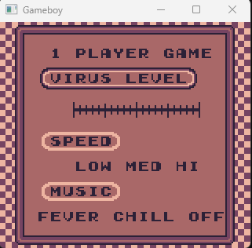

# Windows Gameboy Emulator




This project is a `Gameboy Emulator` written in C++17 using SDL2 for Graphics.


## TODOS/BUGS/MISSING FEATURES
* PPU graphics output wrong for some roms
* PPU Sprites Rendering
* Mappers
* Sound Emulation

### Tested Roms:
* blargg roms
* dmg-acid2.gb //Error
* Dr. Mario
* Asteroids

<!-- ROADMAP -->
## Tests
This emulator was tested using blargg tests

| Test Roms  | Results |
| ------------- |:-------------:|
| 01-special.gb      | Passed    |
| 02-interrupts.gb     | Passed     |
| 03-op sp,hl.gb      | Passed     |
| 04-op r,imm.gb     | Passed    |
| 05-op rp.gb    | Passed    |
| 06-ld r,r.gb     | Passed    |
| 07-jr,jp,call,ret,rst.gb     | Passed     |
| 08-misc instrs.gb    | Passed     |
| 09-op r,r.gb      | Passed     |
| 10-bit ops.gb     | Passed     |
| 11-op a,(hl).gb   | Passed     |
| dmg-acid2.gb   | Failed     |


### Prerequisites
* SDL2
* Premake
* C++
* Visual Studio 2022


### Building

Building the emulator requires Visual Studio 2022 and SDL2. This has only been tested on Windows. To compile the project, run the build.bat in scripts :

```
cd scripts
build.bat //Creates a Gameboy.sln file
```

Open Gameboy.sln and build


## Usage
The bin folder contains the Gameboy.exe release and debug versions.
Requires SDl2.dll

```
usage: Gameboy.exe <rom_file> //Requires SDl2.dll
```

<!-- LICENSE -->
## License

Distributed under the MIT License. See `LICENSE.md` for more information.


<!-- ACKNOWLEDGMENTS -->
## Acknowledgments

* [Pandadocs](https://gbdev.io/pandocs/)
* [CodeSlinger](http://www.codeslinger.co.uk/pages/projects/gameboy.html)
* [Opcodes](https://www.pastraiser.com/cpu/gameboy/gameboy_opcodes.html)
